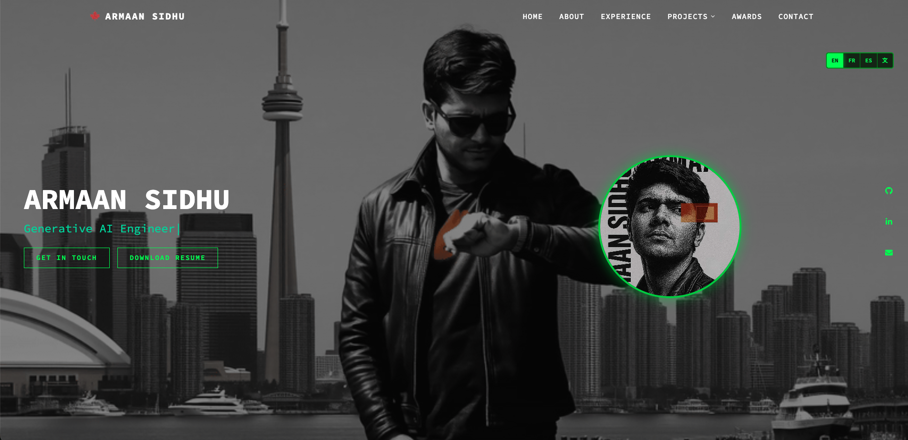

# Portfolio - Armaan Sidhu

## Overview
This project is a high-performance, interactive digital resume and professional showcase for Armaan Sidhu. Built with a specialized "cyber-aesthetic," the portfolio highlights expertise across three core domains: **Generative AI Engineering**, **Cybersecurity Analysis**, and **OSINT Investigation**.

The application moves beyond a static document by utilizing real-time canvas animations, embedded data applications, and a responsive design tailored for technical recruitment and networking.

## Key Features

### 1. Interactive Terminal Aesthetic
The portfolio employs a "Matrix" inspired visual language, utilizing a custom-built canvas engine to render falling character streams and interactive node-link grids.

*   **Dynamic Role Typing**: An automated typing effect cycles through primary professional roles, providing an immediate overview of core competencies.
*   **Responsive "Cyber-Cards"**: Professional experiences and certifications are housed in custom-styled containers that react to user hovering with neon-glow transitions and transformations.

### 2. Integrated Project Ecosystem
Unlike standard portfolios that link away to external sites, this project features integrated wrappers for specialized tools. These are embedded via high-performance iframes to maintain a seamless user experience:

*   **Knowledge Tree**: A centralized hub for data-driven insights.
*   **SentinelXC**: A cybersecurity-focused toolset.
*   **Whimsical**: A showcase for creative or experimental AI implementations.
*   **Nuestra Bóveda**: A specialized project vault.

### 3. Immersive Visual Layering
The site utilizes a multi-layered background system to create depth:

*   **Base Layer**: High-definition looping video background (`in_downtown.mp4`).
*   **Matrix Layer**: A canvas-based character rain effect.
*   **Web-Grid Layer**: A mouse-interactive particle system that connects nodes based on proximity.

## Navigation & Usage
The portfolio is structured as a single-page application (SPA) for speed, utilizing smooth-scroll navigation to move between sections:

| Section | Description |
| :--- | :--- |
| **Home** | The landing hero with dynamic role typing and interactive background. |
| **About** | Professional summary and core philosophy. |
| **Experience** | Chronological career history styled in high-visibility cards. |
| **Projects** | A dropdown-enabled menu linking to embedded Streamlit applications. |
| **Awards** | Recognition and industry-specific honors. |
| **Contact** | Direct communication channels via social icons and email. |

## Technical Architecture
For developers or recruiters interested in the "under-the-hood" performance:

*   **Frontend**: HTML5, Tailwind CSS (Utility-first styling), and custom CSS for the "cyber" UI.
*   **Animations**: AOS (Animate on Scroll) for element entry, and native Canvas API for background effects.
*   **Embeds**: Seamless Streamlit integration using optimized `<iframe>` configurations to prevent layout shifting and white flashes in dark mode.
*   **Internationalization (i18n)**: Comprehensive, zero-dependency translation system supporting English, French, Mandarin, and Spanish. It features dynamic content replacement for text, placeholders, and SEO meta tags without page reloads.

## Interaction Tips
*   **Node Interaction**: In the header and footer sections, moving your mouse will repel or attract the "Web Grid" nodes, simulating an active network.
*   **Project Viewing**: When accessing projects like SentinelXC or Knowledge Tree, the interface automatically optimizes for the embedded Streamlit theme to ensure visual consistency with the main portfolio.

## Copyright
© 2025 Armaan Sidhu. All rights reserved.