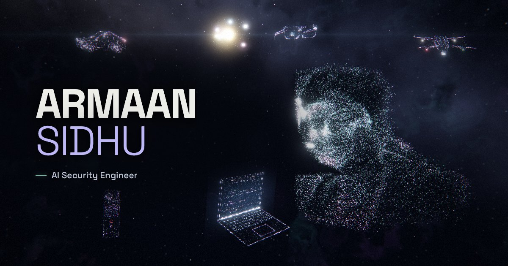

# Armaan Sidhu



My portfolio, live at **[realarmaansidhu.com](https://realarmaansidhu.com)**.

The page is one continuous flight. A galaxy condenses into a portrait drawn from 180,000 stars, the camera dives into the eye, rides a data tunnel past the work and projects, flies through a sun, and turns a key to open a vault. The rest of the page scrolls over the open vault while the stars keep moving behind it.

## How it's built

No framework and no build step: hand-written HTML, CSS and ES modules on top of [three.js](https://threejs.org).

- **One set of stars, many shapes.** Every star carries several target positions (galaxy, portrait, tunnel, padlock), and the vertex shader moves between them as you scroll. The laptop, glasses, drone, gimbal camera and car are drawn in code as point clouds.
- **The portrait is sampled at load time** from a 242 KB image whose channels encode brightness, sampling weight and a silhouette mask, inside a web worker so the page stays responsive.
- **Scroll is anchored to the content.** The flight's beats are pinned to the sections, so About, Work and Projects always pass over the tunnel, whatever the screen size.
- **Built for phones and tablets first.** A layout solver frames the portrait around the real position of the text on each screen, and the number of stars adapts to the device and to measured frame times.
- **Post-processing:** bloom, a sun streak, zoom blur, colour grading and film grain, in a custom pass.
- **Sound** is synthesized live with Web Audio. No audio files.
- **Four languages:** English, French, Spanish and Simplified Chinese. Visitors land in their device's language when it's one of the four (English otherwise) and can switch from the top bar; a choice they make is remembered, and the page keeps them on the same paragraph. Every translation sits beside its English in [`js/i18n.js`](js/i18n.js).
- **Works without the 3D too.** With no WebGL, an old browser, or JavaScript turned off, the same content shows on a still starfield.
- **Security headers:** a strict Content Security Policy and friends in [`_headers`](_headers), plus [`/.well-known/security.txt`](.well-known/security.txt).

## Layout

| Path | What's there |
| --- | --- |
| `index.html`, `style.css` | The page |
| `js/` | The scene (`main.js` conducts it), the content layer (`site.js`), the translations (`i18n.js`), and vendored libraries in `js/vendor/` |
| `assets/` | Photos, the portrait data, icons and the resume |
| `tapedeck/`, `tactracer/`, … | Full-screen pages for each project's live app |
| `tools/` | `serve.py` (local server) and `build-portrait.py` (regenerates the portrait data from a photo) |
| `dev/devices.html` | A device lab that runs the site on many screen sizes at once (local only) |
| `design-previews/` | The design directions explored before this one (local only) |

## Running it locally

```bash
python3 tools/serve.py 8642
```

Then open <http://localhost:8642>. The server mirrors the production headers and serves the 404 page.

© 2026 Armaan Sidhu. All rights reserved.
